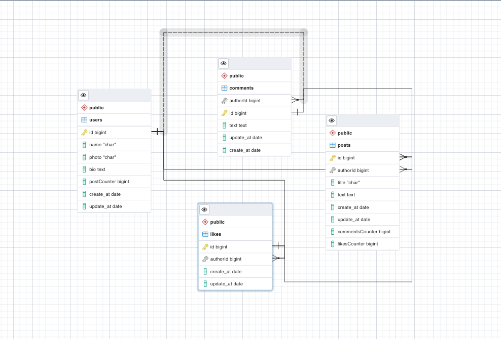

# Blogapp - Ruby and Rails
 This is the Blog app initiated in the fifth module in the Microverse program. It is a simple ruby and rails project
## Built With


- Visual Studio Code
- Ruby
- Ruby & rails
- Rspec
- postgresql
- pgadmin4

 ## App ScreenShot
   in process

 ## Video Preview

 in process

 ## SQL schema
   


## Getting Started

To get a local copy up and running follow these simple steps.

### Prerequisites

- [x] A code editor like Visual Studio Code with Git and Ruby and Rails.

You can check if Git is installed by running the following command in the terminal.
```
$ git --version
```

Likewise for Ruby installation.
```
$ ruby --version
```

Likewise for Rails installation.
```
$ rails --version
```
Likewise for pg installation.
```
$ pg --version
```

### Setup

Clone the repository using the GitHub link provided below.

### Install

In the terminal, go to your file directory and run this command.

```
$ git clone https://github.com/nimplay/blog-app.git
```
```
$ bundle install```


## Authors

👤 **Nimrod Acosta**

- GitHub: [nimplay](https://github.com/nimplay)

- Twitter: [NimrodAcosta](https://twitter.com/NimrodAcosta)

- LinkedIn: [nimrod-acosta](https://www.linkedin.com/in/nimrod-acosta-734330169/)

## 🤝 Contributing

Contributions, issues, and feature requests are welcome!

Feel free to check the [issues page](../../issues/).

## Show your support
Give a ⭐️ if you like this project!

## Acknowledgments

- [Microverse](https://github.com/microverseinc) team.
- Coding Partners.
- Code Reviewers.

## 📝 License

This project is [MIT](./LICENSE) licensed.

